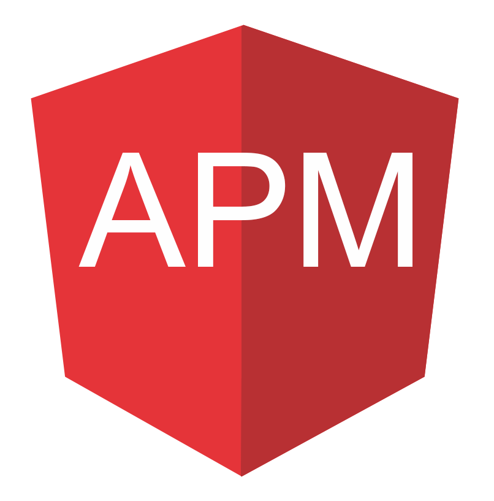

前端数据异常采集系统
================
<p align="center">
  <a href="./" target="blank"></a>
</p>

# 介绍


# 快速开始

下载本项目到本地
```
git clone https://github.com/stbui/apm
```

# 项目结构
> apm-admin-front-angular

前端项目，基于[angular-material-app](https://github.com/stbui/angular-material-app)项目搭建，

> amp-admin-serve-netstjs

后端项目, 基于`nestjs`框架开发

> apm-js-sdk

收集数据sdk
